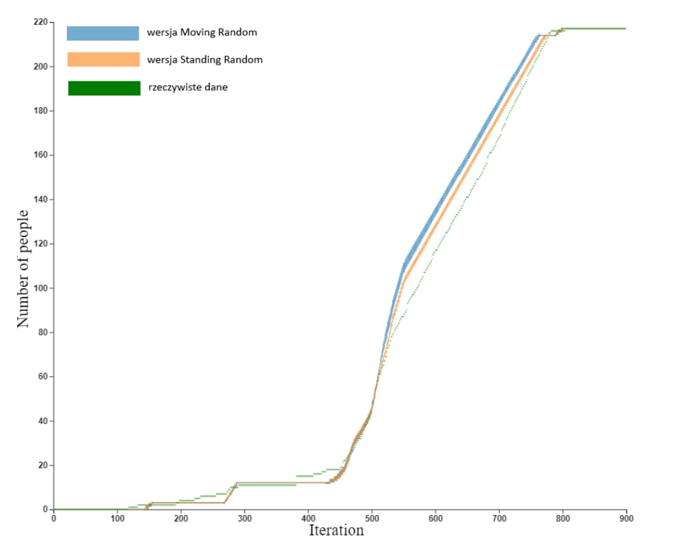

# Raport 2 – Metody walidacji i założenia modelowe

## Metody walidacji

W celu oceny poprawności opracowanej symulacji ewakuacji przyjęto trzy metody walidacji:

1. **Krzywa ewakuacji** – zależność liczby osób wyewakuowanych od czasu. Krzywa wyznaczona w symulacji powinna ilościowo odpowiadać danym empirycznym z rzeczywistego zdarzenia ewakuacyjnego. Odchylenie przebiegu obu krzywych stanowi miarę dokładności modelu.

2. **Sekwencje ewakuacji** – migawki stanu symulacji w wybranych momentach czasowych, umożliwiające analizę rozkładu przestrzennego osób w trakcie ewakuacji. Tory ruchu oraz lokalizacje obszarów o zwiększonym zagęszczeniu (punkty zatłoczenia) powinny jakościowo odpowiadać obserwacjom z rzeczywistej ewakuacji.

3. **Identyfikacja punktów zatłoczenia** – wyznaczenie miejsc o lokalnie wysokim zagęszczeniu osób, stanowiących potencjalne wąskie gardła procesu ewakuacji.

Walidacja sekwencji ewakuacji oraz identyfikacja punktów zatłoczenia przeprowadzona zostanie poprzez bezpośrednią obserwację przebiegu symulacji. Krzywą ewakuacji pozyskano z dostępnej literatury naukowej. Ze względu na brak dostępu do surowych danych pomiarowych, krzywa ta została odtworzona syntetycznie z wykorzystaniem alternatywnej metody aproksymacji.

## Dane walidacyjne

Dane walidacyjne zostały wyekstrachowane na podstawie wykresu rzeczywistych danych ewakuacyjnych, zbieranych ręcznie na podstawie danych z monitoringu z okresu rzeczywistej próby ewakuacji w D17. Z rzeczywistych danych odczytano około 560 punktów (x,y) w których x oznacza sekundę działania symulacji, przy założeniu, że jedna iteracja(/tick w przypadku net logo) symulacji trwa jedną sekundę. Zmienna y oznacza ilość osób które są bezpiecznie poza budynkiem w wyznaczonym miejscu ewakuacji, w określonym momencie czasu

## Rozmiar komórki siatki dyskretyzacji

W analizowanej literaturze naukowej powszechnie stosuje się zróżnicowany rozmiar komórki siatki dyskretyzacji dla poszczególnych kondygnacji lub sekcji budynku. Zabieg ten umożliwia wierne odwzorowanie rzeczywistej przepustowości przejść – przykładowo, przejście o większej szerokości może zachowywać się funkcjonalnie identycznie jak przejście węższe, jeśli jego geometria faktycznie ogranicza jednoczesny przepływ do jednej osoby.

## Założenia modelowe

Przyjęto, że częstotliwość opuszczania pomieszczenia przez ewakuujące się osoby wynosi **jedna osoba na sekundę**. W praktyce modelowej parametr ten określa interwał czasowy, z jakim kolejne osoby pojawiają się przy wyjściu z sali, i stanowi podstawę kalibracji strumienia ewakuacyjnego.
