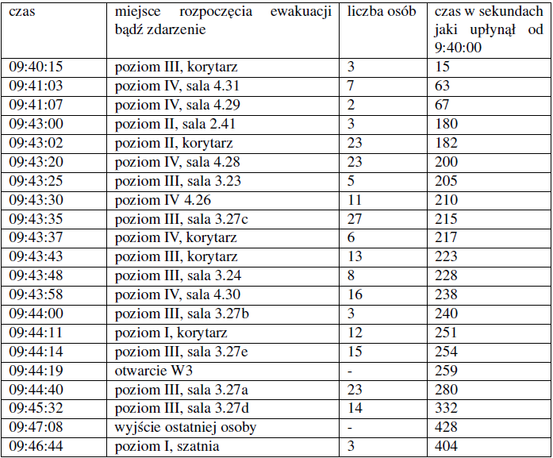
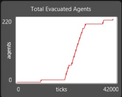
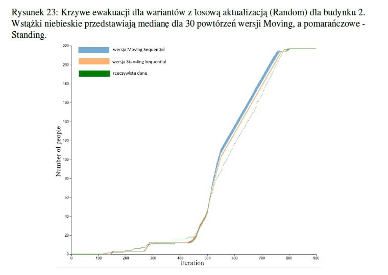

# Raport 6 – Gotowa symulacja ewakuacji D17 w NetLogo

## Dokońcozna mapa D17

Mapa obecnie uwzględnia wszystkie 4 piętra budynku D17. Rozwiązanie zakłada 2 klatki schodowe oraz 3 wyjścia ewakuacyjne, jedne główne drzwi D17, drugie przy klatce schodowej obok wind oraz ostatnie w okolicy bistro. 2 pierwsze wyjścia z założenia są znane osobom ewakuującym się, natomiast trzecie było w sytuacji ewakuacji najmniej popularne, przez co wiedza o nim została sparametryzowana za pomocą współczynnika globalnego, który określa jaka jest szansa że pojedynczy agent symulacji wie o tymże wyjściu. Jeśli dany agent ma wiedze o tym wyjściu, rozważamy je wraz z innymi pod kątem najkrótszej ścieżki.

## Parametry wywołania symulacji

Symulacja posiada szereg paramerów:
- ticks-per-move - ustawione na 20 w związku z uprzednią synchronizacją na danych testowych
- scale-factor - ustawione na 4 w związku z uprzednią synchronizacją na danych testowych
- wall-thickness - ustawione na 6 w związku z uprzednią synchronizacją na danych testowych
- knowledge-of-alternative-exits - parametr ustalający szanse pojedynczego agenta na świadomość o trzecim wyjściu ewakuacyjnym - bazowo ustawiony na 20
- late-exit-opening-tick - parametr określający w którym momencie otwarte zostały pierwotnie trzecie drzwi ewakuacyjne - bazowo ustawione na 2000 tick, czyli 20 sekundę
- personal space - parametr określający jak dużo przestrzeni wokół agenta musi być zachowane w każdym momencie - bazowo ustawione na 0.2

## Dane na temat ilości osób w salach i początku ewakuacji

Wszyscy agenci wychodzący z sal zostali skonfigurowani na bazie danych z ewakuacji budynku D17, podającymi ilość osób w konkretnych punktach startowych ewakuacji oraz momenty początku ewakuacji dla każdego z podanych punktów startowych

## Wykresy krzywych ewakuacji - porównanie symulacji net logo i symulacji magisterskiej

Na podstawie symulacji przygotowano wykres krzywej ewakuacji pokazujący ilość ewakuowanych osób w zależności od czasu (ticks - 100 ticków to 1 sekunda). Wykres został porównany z wykresem podanym w pracy magisterskiej pokazujący tą samą zależność na podstawie tamtejszej symulacji

Nasz wykres krzywej ewakuacji:

Wykres krzywej ewakuacji z pracy magisterskiej:

