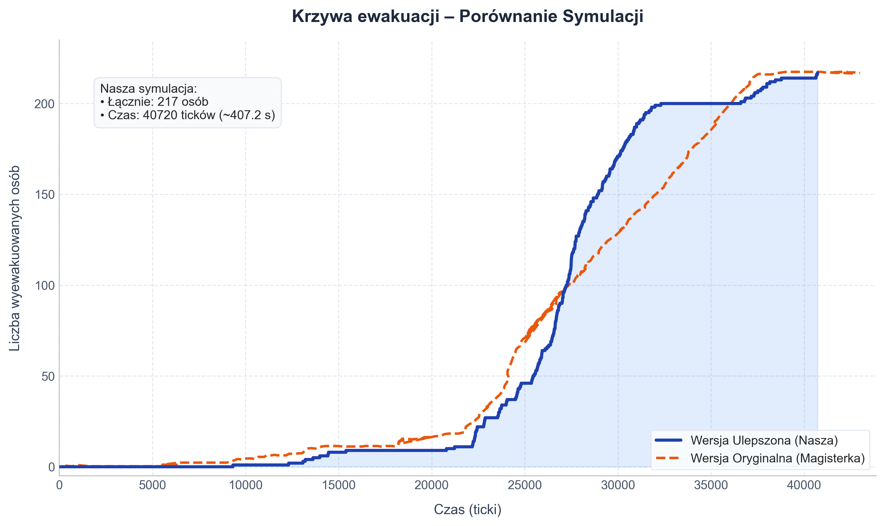
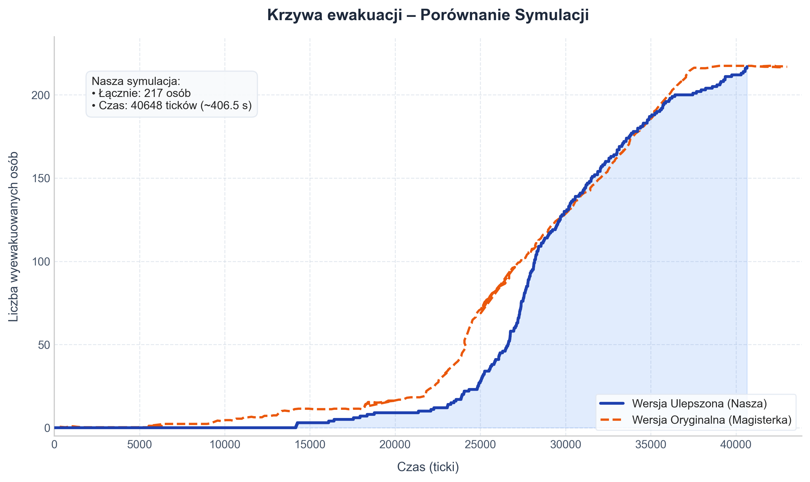

# Raport 7 – Raport końcowy

## Opóźnienie otwarcia drzwi pod schodami jednymi oraz drugimi
Przesunęliśmy moment otwarcia drzwi ewakuacyjnych pod schodami an 259 sekundę zgodnie z danymi z pracy magisterskiej

## Prędkość oraz ruch na schodach 
Prędkość na schodach została zmniejszona względem prędkości na piętrze, co powoduje widoczne zatory, zgodnie z rzeczywistymi obserwacjami. Dodatkowo dodaliśmy model zbaczania z optymalnej trasy w momencie kiedy nie jesteśmy w stanie iść do przodu obecną ścieżką, a mamy obok siebie w porządanym kierunku wolne pola. Sprawia to duże większe wrażenie naturalnego tłoku i poruszania się pełną szerokością klatki schodowej. 

## Dodanie zróżnicowania prędkości
Bazowa prędkość została ustalona na podstawie kalibracji na prostym modelu wziętym z filmu z wychodzeniem za ścianę i ustaliła prędkość na ruch co 20 ticków. Wprowadziliśmy dodatkowo żeby agenci posiadali prędkości wynikające z rozkładu normalnego ze średnim ruchem co 20 ticków, co wprowadziło bardziej rzeczywiste obserwacje i wypłaszczenie ząbków na wykresie

## Dodanie możliwości powstawania zatorów (tworzenie łuków)

W następnym kroku dodaliśmy warunek w którym kiedy 3 lub 4 agentów planowało wejść na dane pole to mamy odpowiednio 35% oraz 70% szans na to że nikt na nie nie wejdzie (wypychają siebie nawzajem)

## Dodanie mechanizmu męczenia się w trakcie schodzenia po schodach

W celu wypłaszczenia ostatniej fazy naszej symulacji dodaliśmy mechanizm w którym agenci męczą się przebywając na schodach, stopniowo zmniejszając swoją prędkość ruchu - do maksymalnie 1,5 raza parametru co ile tickow ruch - czyli np. z ruchu co 20 tickow zwalniaja do maksymalnie ruchu co 30 tickow.

## Porównanie wykresów danych symulacji i danych rzeczywistych

### Po zmianach otwarcia drzwi oraz zmiany ordynacji ruchu na schodach

### Po dodaniu zróżnicowanej prędkości

### Po dodaniu możliwości powstawania zatorów

### Po dodaniu mechanizmu męczenia się uczestników ewakuacji na schodach

